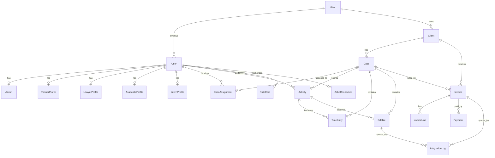

# Database Schema

This backend uses MongoDB with Mongoose. The Mongoose model files under `src/modules/**/models` are the runtime source of truth; this document summarizes the logical schema, references, indexes, and collection responsibilities.

## Entity Relationship Overview

## Collection Summary

| Collection | Mongoose model | Purpose |
| --- | --- | --- |
| `firms` | `Firm` | Law firm tenant, billing defaults, tax settings, address. |
| `users` | `User` | Application users and authentication identity. |
| `admins` | `Admin` | Admin role metadata for a user within a firm. |
| `partnerprofiles` | `PartnerProfile` | Partner-specific professional profile and rate. |
| `lawyerprofiles` | `LawyerProfile` | Lawyer-specific professional profile and rate. |
| `associateprofiles` | `AssociateProfile` | Associate-specific professional profile and rate. |
| `internprofiles` | `InternProfile` | Intern-specific profile, mentor, focus, and rate. |
| `clients` | `Client` | Client accounts, contacts, owner, payment terms, Zoho CRM mapping. |
| `cases` | `Case` | Legal matters/cases for a client. |
| `caseassignments` | `CaseAssignment` | Case-to-user assignment records. |
| `activities` | `Activity` | Raw legal work activity captured manually or from integrations. |
| `emailentries` | `EmailEntry` | Email capture records before or during billing conversion. |
| `timeentries` | `TimeEntry` | Time records used for review, approval, and billing. |
| `billables` | `Billable` | Billable work items used by invoices and external sync. |
| `ratecards` | `RateCard` | User/case/activity rate history. |
| `invoices` | `Invoice` | Invoice header plus embedded billable items. |
| `invoicelines` | `InvoiceLine` | Invoice line records tied to approved time entries. |
| `payments` | `Payment` | Payments against invoices. |
| `kpisnapshots` | `KpiSnapshot` | Monthly denormalized KPI metrics by firm, user, client, or case. |
| `zohoconnections` | `ZohoConnection` | Per-user Zoho OAuth tokens and module configuration. |
| `integrationlogs` | `IntegrationLog` | Audit trail for outbound platform syncs. |

## Core Collections

### `firms`

Stores tenant-level firm settings.

| Field | Type | Required | Notes |
| --- | --- | --- | --- |
| `_id` | ObjectId | yes | Primary document id. |
| `name` | String | yes | Trimmed firm name. |
| `currency` | String | no | Defaults to `INR`. |
| `taxSettings.taxName` | String | no | Defaults to `GST`. |
| `taxSettings.taxRatePct` | Number | no | Defaults to `0`. |
| `taxSettings.inclusive` | Boolean | no | Defaults to `false`. |
| `address.line1` | String | no | Address line 1. |
| `address.line2` | String | no | Address line 2. |
| `address.city` | String | no | City. |
| `address.state` | String | no | State. |
| `address.postalCode` | String | no | Postal/ZIP code. |
| `address.country` | String | no | Defaults to `IN`. |
| `billingPreferences.defaultRate` | Number | no | Default hourly billing rate. |
| `billingPreferences.autoSync` | Boolean | no | Defaults to `false`. |
| `createdAt`, `updatedAt` | Date | yes | Managed by Mongoose timestamps. |

Indexes:

- `{ name: 1 }`

### `users`

Stores login identity and common user profile fields.

| Field | Type | Required | Notes |
| --- | --- | --- | --- |
| `_id` | ObjectId | yes | Primary document id. |
| `name` | String | yes | Trimmed and unique. |
| `email` | String | no | Trimmed. |
| `role` | String | yes | `partner`, `lawyer`, `associate`, `intern`, or `admin`; defaults to `lawyer`. |
| `firmId` | ObjectId -> `firms._id` | no | Owning firm. |
| `passwordHash` | String | yes | Hashed credential. |
| `photoUrl` | String | no | Defaults to `/images/default-user.jpg`. |
| `mobile` | String | yes | Trimmed login identifier; unique sparse index. |
| `address` | String | no | Optional profile address. |
| `qualifications[]` | Object[] | no | `degree`, `university`, `year`. |

Implicit indexes from schema options:

- `name` unique
- `mobile` unique sparse

### `admins`

Maps an application user to an administrative role.

| Field | Type | Required | Notes |
| --- | --- | --- | --- |
| `_id` | ObjectId | yes | Primary document id. |
| `userId` | ObjectId -> `users._id` | yes | Unique. |
| `firmId` | ObjectId -> `firms._id` | yes | Admin firm. |
| `role` | String | no | `firm_admin` or `super_admin`; defaults to `firm_admin`. |
| `createdAt`, `updatedAt` | Date | yes | Managed by Mongoose timestamps. |

Indexes:

- `userId` unique
- `{ firmId: 1 }`

### User Profile Collections

Each profile collection has a unique `userId` reference to `users._id`.

#### `partnerprofiles`

| Field | Type | Notes |
| --- | --- | --- |
| `userId` | ObjectId -> `users._id` | Required, unique. |
| `title` | String | Example: `Managing Partner`. |
| `specialization[]` | String[] | Defaults to empty array. |
| `experienceYears` | Number | Optional. |
| `landmarkCases[]` | Object[] | `caseTitle`, `year`, `description`. |
| `achievements[]` | Object[] | `title`, `year`, `description`. |
| `publications[]` | Object[] | `title`, `link`, `year`. |
| `billingRate` | Number | Defaults to `4000`. |

#### `lawyerprofiles`

| Field | Type | Notes |
| --- | --- | --- |
| `userId` | ObjectId -> `users._id` | Required, unique. |
| `specialization[]` | String[] | Defaults to empty array. |
| `experienceYears` | Number | Optional. |
| `landmarkCases[]` | Object[] | `caseTitle`, `year`, `description`. |
| `achievements[]` | Object[] | `title`, `year`, `description`. |
| `billingRate` | Number | Defaults to `2500`. |

#### `associateprofiles`

| Field | Type | Notes |
| --- | --- | --- |
| `userId` | ObjectId -> `users._id` | Required, unique. |
| `specialization[]` | String[] | Defaults to empty array. |
| `experienceYears` | Number | Optional. |
| `achievements[]` | Object[] | `title`, `year`, `description`. |
| `billingRate` | Number | Defaults to `1500`. |

#### `internprofiles`

| Field | Type | Notes |
| --- | --- | --- |
| `userId` | ObjectId -> `users._id` | Required, unique. |
| `lawSchool` | String | Optional. |
| `graduationYear` | Number | Optional. |
| `mentor` | ObjectId -> `users._id` | Optional mentor user. |
| `internshipFocus` | String | Optional. |
| `billingRate` | Number | Defaults to `750`. |

## Client and Matter Collections

### `clients`

Stores client account data and CRM linkage.

| Field | Type | Required | Notes |
| --- | --- | --- | --- |
| `_id` | ObjectId | yes | Primary document id. |
| `displayName` | String | yes | Trimmed client display name. |
| `name` | String | no | Deprecated legacy field. |
| `email` | String | no | Primary email. |
| `phone` | String | no | Primary phone. |
| `contactInfo` | String | no | Legacy/freeform contact info. |
| `firmId` | ObjectId -> `firms._id` | no | Owning firm. |
| `ownerUserId` | ObjectId -> `users._id` | no | Responsible user. |
| `status` | String | no | `active`, `inactive`, or `prospect`; defaults to `active`. |
| `paymentTerms` | String | no | Defaults to `NET30`. |
| `contacts[]` | Object[] | no | Client contacts. |
| `contacts[].integrations.zoho.crmRecordId` | String | no | Zoho contact id. |
| `contacts[].integrations.zoho.lastSyncedAt` | Date | no | Last Zoho sync timestamp. |
| `integrations.zoho.crmModule` | String | no | Defaults to `Accounts`. |
| `integrations.zoho.crmRecordId` | String | no | Zoho account id. |
| `integrations.zoho.lastSyncedAt` | Date | no | Last Zoho sync timestamp. |
| `createdAt`, `updatedAt` | Date | yes | Managed by Mongoose timestamps. |

Indexes:

- `status`
- `{ displayName: "text", email: 1, phone: 1 }`

### `cases`

Stores legal matters/cases.

| Field | Type | Required | Notes |
| --- | --- | --- | --- |
| `_id` | ObjectId | yes | Primary document id. |
| `clientId` | ObjectId -> `clients._id` | yes | Parent client. |
| `title` | String | yes | Trimmed case title. |
| `name` | String | no | Deprecated legacy field. |
| `description` | String | no | Case description. |
| `status` | String | no | `open`, `closed`, `pending`, or `archived`; defaults to `open`. |
| `openedAt` | Date | no | Defaults to current date. |
| `closedAt` | Date | no | Closure date. |
| `leadPartnerId` | ObjectId -> `users._id` | no | Lead partner. |
| `managingLawyerId` | ObjectId -> `users._id` | no | Managing lawyer. |
| `primaryLawyerId` | ObjectId -> `users._id` | no | Primary lawyer. |
| `assignedUsers[]` | ObjectId[] -> `users._id` | no | Denormalized assignment list. |
| `billingType` | String | no | `hourly`, `fixed_fee`, `contingency`, or `retainer`; defaults to `hourly`. |
| `case_type` | String | no | Trimmed case type label. |
| `case_type_id` | ObjectId | no | Indexed case type id. |
| `integrations.zoho.crmModule` | String | no | Defaults to `Deals`. |
| `integrations.zoho.crmRecordId` | String | no | Zoho deal id. |
| `integrations.zoho.workdriveFolderId` | String | no | Linked WorkDrive folder id. |
| `integrations.zoho.workdriveFolderUrl` | String | no | Linked WorkDrive folder URL. |
| `integrations.zoho.lastSyncedAt` | Date | no | Last Zoho sync timestamp. |
| `createdAt`, `updatedAt` | Date | yes | Managed by Mongoose timestamps. |

Indexes:

- `clientId`
- `status`
- `case_type_id`
- `{ clientId: 1, status: 1 }`
- `{ title: "text", description: "text" }`

### `caseassignments`

Stores assignment history between cases and users.

| Field | Type | Required | Notes |
| --- | --- | --- | --- |
| `_id` | ObjectId | yes | Primary document id. |
| `caseId` | ObjectId -> `cases._id` | yes | Assigned case. |
| `userId` | ObjectId -> `users._id` | yes | Assigned user. |
| `role` | String | no | `partner`, `associate`, `admin`, or `primary`; defaults to `associate`. |
| `startAt` | Date | no | Assignment start. |
| `endAt` | Date | no | Assignment end. |
| `assignedBy` | ObjectId -> `users._id` | no | Assigning user. |
| `assignedAt` | Date | no | Defaults to current date. |
| `status` | String | no | `active` or `inactive`; defaults to `active`. |
| `firmId` | ObjectId -> `firms._id` | no | Denormalized for analytics/filtering. |
| `clientId` | ObjectId -> `clients._id` | no | Denormalized for analytics/filtering. |
| `createdAt`, `updatedAt` | Date | yes | Managed by Mongoose timestamps. |

Indexes:

- `caseId`
- `userId`
- `firmId`
- `clientId`
- `{ caseId: 1, userId: 1 }` unique
- `{ firmId: 1, clientId: 1, status: 1 }`
- `{ caseId: 1, status: 1 }`

## Work Capture and Billing Collections

### `activities`

Stores raw captured legal work.

| Field | Type | Required | Notes |
| --- | --- | --- | --- |
| `_id` | ObjectId | yes | Primary document id. |
| `caseId` | ObjectId -> `cases._id` | yes | Case context. |
| `clientId` | ObjectId -> `clients._id` | yes | Client context. |
| `userId` | ObjectId -> `users._id` | yes | Performing user. |
| `activityType` | String | yes | `email`, `drafting`, `review`, `meeting`, `hearing`, `research`, `call`, or `other`. |
| `startedAt` | Date | no | Work start. |
| `endedAt` | Date | no | Work end. |
| `durationMinutes` | Number | no | Minimum `0`. |
| `source` | String | no | `gmail`, `extension`, `manual`, `integration`, or `system`; defaults to `extension`. |
| `sourceRef` | String | no | Source system reference. |
| `narrative` | String | no | Work description. |
| `activityCode` | String | no | Billing activity code. |
| `createdAt`, `updatedAt` | Date | yes | Managed by Mongoose timestamps. |

Indexes:

- `caseId`
- `clientId`
- `userId`
- `{ caseId: 1, userId: 1, createdAt: -1 }`

### `emailentries`

Stores captured emails and mapping/conversion metadata.

| Field | Type | Required | Notes |
| --- | --- | --- | --- |
| `_id` | ObjectId | yes | Primary document id. |
| `userId` | ObjectId -> `users._id` | no | User who captured the email. |
| `userEmail` | String | no | Sender/user email. |
| `recipient` | String | yes | Email recipient. |
| `subject` | String | yes | Email subject. |
| `body` | String | no | Email body. |
| `typingTimeSeconds` | Number | no | Minimum `0`. |
| `typingTimeMinutes` | Number | no | Minimum `0`. |
| `mappedClientId` | ObjectId -> `clients._id` | no | Mapped client. |
| `mappedCaseId` | ObjectId -> `cases._id` | no | Mapped case. |
| `clientId` | ObjectId -> `clients._id` | no | Client context. |
| `caseId` | ObjectId -> `cases._id` | no | Case context. |
| `billableSummary` | String | no | AI or user generated billing summary. |
| `workDate` | Date | no | Defaults to current date. |
| `rate` | Number | no | Applied billing rate. |
| `source` | String | no | `gmail` or `extension`; defaults to `extension`. |
| `meta` | Mixed | no | Arbitrary integration metadata. |
| `createdAt`, `updatedAt` | Date | yes | Managed by Mongoose timestamps. |

Indexes:

- `{ recipient: 1, subject: 1, createdAt: -1 }`

### `timeentries`

Stores reviewable time records.

| Field | Type | Required | Notes |
| --- | --- | --- | --- |
| `_id` | ObjectId | yes | Primary document id. |
| `caseId` | ObjectId -> `cases._id` | yes | Case context. |
| `clientId` | ObjectId -> `clients._id` | yes | Client context. |
| `userId` | ObjectId -> `users._id` | yes | Timekeeper. |
| `activityId` | ObjectId -> `activities._id` | no | Source activity. |
| `activityCode` | String | no | Billing activity code. |
| `narrative` | String | yes | Billing narrative. |
| `billableMinutes` | Number | no | Minimum `0`; defaults to `0`. |
| `nonbillableMinutes` | Number | no | Minimum `0`; defaults to `0`. |
| `rateApplied` | Number | no | Minimum `0`. |
| `amount` | Number | no | Minimum `0`. |
| `date` | Date | no | Defaults to current date. |
| `status` | String | no | `draft`, `submitted`, `approved`, `billed`, `paid`, or `rejected`; defaults to `draft`. |
| `external.system` | String | no | External platform name. |
| `external.entryId` | String | no | External entry id. |
| `external.syncedAt` | Date | no | Last external sync timestamp. |
| `createdAt`, `updatedAt` | Date | yes | Managed by Mongoose timestamps. |

Indexes:

- `caseId`
- `clientId`
- `userId`
- `status`
- `{ clientId: 1, caseId: 1, date: -1 }`

### `billables`

Stores billable work items and sync metadata.

| Field | Type | Required | Notes |
| --- | --- | --- | --- |
| `_id` | ObjectId | yes | Primary document id. |
| `caseId` | ObjectId -> `cases._id` | yes | Case context. |
| `clientId` | ObjectId -> `clients._id` | yes | Client context. |
| `userId` | ObjectId -> `users._id` | yes | Timekeeper. |
| `activityId` | ObjectId -> `activities._id` | no | Source activity. |
| `subject` | String | no | Optional subject. |
| `status` | String | no | `Pending`, `Logged`, or `Failed`; defaults to `Pending`. |
| `activityCode` | String | no | `EMAIL`, `CALL`, `MEETING`, `DOC_REVIEW`, `RESEARCH`, `NEGOTIATION`, `ADMIN`, or `OTHER`; defaults to `EMAIL`. |
| `category` | String | yes | Controlled billing category. |
| `description` | String | yes | Billing description. |
| `durationMinutes` | Number | yes | Work duration. |
| `rate` | Number | yes | Hourly rate. |
| `amount` | Number | yes | Calculated as `rate * hours` during validation if missing or `0`. |
| `date` | Date | yes | Work date. |
| `pushedAt` | Date | no | External push timestamp. |
| `externalEntryId` | String | no | External entry id. |
| `createdAt`, `updatedAt` | Date | yes | Managed by Mongoose timestamps. |

Virtuals:

- `hours` = `durationMinutes / 60`

Indexes:

- `activityId`
- `{ clientId: 1, caseId: 1, date: -1 }`
- `{ userId: 1, date: -1 }`
- `{ activityId: 1, date: -1 }`

### `ratecards`

Stores rate history for user/case/activity combinations.

| Field | Type | Required | Notes |
| --- | --- | --- | --- |
| `_id` | ObjectId | yes | Primary document id. |
| `userId` | ObjectId -> `users._id` | yes | Timekeeper. |
| `caseId` | ObjectId -> `cases._id` | no | Optional case-specific rate. |
| `activityCode` | String | no | Optional activity-specific rate. |
| `ratePerHour` | Number | yes | Minimum `0`. |
| `effectiveFrom` | Date | yes | Start date. |
| `effectiveTo` | Date | no | End date. |
| `createdAt`, `updatedAt` | Date | yes | Managed by Mongoose timestamps. |

Indexes:

- `userId`
- `{ userId: 1, caseId: 1, activityCode: 1, effectiveFrom: -1 }`

## Invoice and Receivables Collections

### `invoices`

Stores invoice header data and embedded billable items.

| Field | Type | Required | Notes |
| --- | --- | --- | --- |
| `_id` | ObjectId | yes | Primary document id. |
| `clientId` | ObjectId -> `clients._id` | yes | Invoice recipient. |
| `caseId` | ObjectId -> `cases._id` | no | Matter-specific invoice. |
| `periodStart` | Date | no | Billing period start. |
| `periodEnd` | Date | no | Billing period end. |
| `issueDate` | Date | no | Defaults to current date. |
| `dueDate` | Date | no | Payment due date. |
| `currency` | String | no | Defaults to `INR`. |
| `subtotal` | Number | no | Recomputed from embedded items on validation. |
| `tax` | Number | no | Defaults to `0`. |
| `total` | Number | yes | Recomputed as `subtotal + tax` on validation. |
| `status` | String | no | `draft`, `sent`, `partial`, `paid`, `overdue`, or `void`; defaults to `draft`. |
| `pdfUrl` | String | no | Generated invoice PDF URL. |
| `createdBy` | ObjectId -> `users._id` | no | Creator user. |
| `integrations.zoho.crmModule` | String | no | Defaults to `Invoices`. |
| `integrations.zoho.crmRecordId` | String | no | Zoho invoice id. |
| `integrations.zoho.lastSyncedAt` | Date | no | Last Zoho sync timestamp. |
| `items[]` | Object[] | no | Embedded invoice items. |
| `items[].billableId` | ObjectId -> `billables._id` | no | Source billable. |
| `items[].description` | String | no | Item description. |
| `items[].durationMinutes` | Number | no | Item duration. |
| `items[].rate` | Number | no | Item rate. |
| `items[].amount` | Number | no | Item amount. |
| `createdAt`, `updatedAt` | Date | yes | Managed by Mongoose timestamps. |

Indexes:

- `clientId`
- `status`
- `items.billableId`
- `{ clientId: 1, status: 1, issueDate: 1 }`
- `{ caseId: 1, status: 1 }`

### `invoicelines`

Stores normalized invoice line records tied to time entries.

| Field | Type | Required | Notes |
| --- | --- | --- | --- |
| `_id` | ObjectId | yes | Primary document id. |
| `invoiceId` | ObjectId -> `invoices._id` | yes | Parent invoice. |
| `timeEntryId` | ObjectId -> `timeentries._id` | no | Source time entry. |
| `description` | String | yes | Line description. |
| `qtyHours` | Number | yes | Minimum `0`. |
| `rate` | Number | yes | Minimum `0`. |
| `amount` | Number | yes | Minimum `0`. |
| `createdAt`, `updatedAt` | Date | yes | Managed by Mongoose timestamps. |

Indexes:

- `invoiceId`

### `payments`

Stores payment receipts and reconciliation state.

| Field | Type | Required | Notes |
| --- | --- | --- | --- |
| `_id` | ObjectId | yes | Primary document id. |
| `invoiceId` | ObjectId -> `invoices._id` | yes | Paid invoice. |
| `amount` | Number | yes | Minimum `0`. |
| `method` | String | yes | `bank_transfer`, `cheque`, `cash`, `card`, `upi`, `wallet`, or `other`. |
| `receivedDate` | Date | yes | Date received. |
| `reference` | String | no | Trimmed payment reference. |
| `status` | String | no | `pending`, `cleared`, or `failed`; defaults to `cleared`. |
| `receivedBy` | ObjectId -> `users._id` | no | Receiving user. |
| `notes` | String | no | Trimmed notes. |
| `createdAt`, `updatedAt` | Date | yes | Managed by Mongoose timestamps. |

Indexes:

- `invoiceId`
- `{ invoiceId: 1, receivedDate: -1 }`

## Analytics and Integration Collections

### `kpisnapshots`

Stores denormalized monthly KPIs.

| Field | Type | Required | Notes |
| --- | --- | --- | --- |
| `_id` | ObjectId | yes | Primary document id. |
| `scope` | String | yes | `firm`, `user`, `client`, or `case`. |
| `scopeId` | ObjectId | no | Referenced entity id for the selected scope. |
| `month` | String | yes | `YYYY-MM`. |
| `utilization` | Number | no | Defaults to `0`. |
| `realization` | Number | no | Defaults to `0`. |
| `WIP` | Number | no | Defaults to `0`. |
| `AR` | Number | no | Defaults to `0`. |
| `revenue` | Number | no | Defaults to `0`. |
| `createdAt`, `updatedAt` | Date | yes | Managed by Mongoose timestamps. |

Indexes:

- `{ scope: 1, scopeId: 1, month: 1 }` unique with partial filter `{ scopeId: { $exists: true } }`
- `{ scope: 1, month: 1 }`

### `zohoconnections`

Stores per-user Zoho OAuth and integration configuration.

| Field | Type | Required | Notes |
| --- | --- | --- | --- |
| `_id` | ObjectId | yes | Primary document id. |
| `userId` | ObjectId -> `users._id` | yes | Unique Zoho-authorizing user. |
| `location` | String | no | Defaults to `us`. |
| `accountsServer` | String | yes | Zoho accounts server. |
| `apiDomain` | String | yes | Zoho API domain. |
| `accessToken` | String | yes | Current access token. |
| `refreshToken` | String | yes | Refresh token. |
| `tokenType` | String | no | Defaults to `Bearer`. |
| `accessTokenExpiresAt` | Date | yes | Access token expiry. |
| `scopes[]` | String[] | no | OAuth scopes. |
| `teamFolderId` | String | no | Zoho WorkDrive team folder id. |
| `teamFolderUrl` | String | no | Zoho WorkDrive team folder URL. |
| `crmModules.clients` | String | no | Defaults to `Accounts`. |
| `crmModules.matters` | String | no | Defaults to `Deals`. |
| `raw` | Mixed | no | Raw provider response/config. |
| `createdAt`, `updatedAt` | Date | yes | Managed by Mongoose timestamps. |

Indexes:

- `userId` unique

### `integrationlogs`

Stores sync attempts and provider payloads.

| Field | Type | Required | Notes |
| --- | --- | --- | --- |
| `_id` | ObjectId | yes | Primary document id. |
| `billableId` | ObjectId -> `billables._id` | no | Related billable. |
| `invoiceId` | ObjectId -> `invoices._id` | no | Related invoice. |
| `platform` | String | yes | `Zoho`, `PracticePanther`, or `MyCase`. |
| `status` | String | no | `pending`, `success`, or `failed`; defaults to `pending`. |
| `request` | Mixed | no | Outbound request payload. |
| `response` | Mixed | no | Provider response payload. |
| `error` | Mixed | no | Error payload. |
| `createdAt`, `updatedAt` | Date | yes | Managed by Mongoose timestamps. |

Indexes:

- `status`
- `{ platform: 1, createdAt: -1 }`
- `{ billableId: 1, createdAt: -1 }`
- `{ invoiceId: 1, createdAt: -1 }`

## Data Flow Notes

1. A `Firm` owns `User` and `Client` records.
2. A `Client` owns one or more `Case` records.
3. Case staffing is represented by `CaseAssignment`; `Case.assignedUsers` is a denormalized convenience field.
4. Work is captured as `Activity`, `EmailEntry`, or directly as `TimeEntry`/`Billable` depending on the route.
5. `RateCard` resolves user/case/activity pricing before calculating `TimeEntry` or `Billable` amounts.
6. `Invoice` embeds billable items, while `InvoiceLine` supports normalized invoice lines from time entries.
7. `Payment` documents reconcile against `Invoice`.
8. `KpiSnapshot` stores monthly rollups so analytics endpoints do not need to recompute every metric from raw billing records.
9. Zoho sync state is split between per-record `integrations.zoho` fields, per-user `ZohoConnection`, and audit-oriented `IntegrationLog`.

## Implementation Notes

- MongoDB does not enforce these references as foreign keys; application code and Mongoose validation enforce required references and enum constraints.
- Most financial collections store numeric amounts as `Number`. If sub-paise precision, currency conversion, or audit-grade accounting becomes a requirement, migrate amounts to integer minor units.
- The current invoice model has both embedded `items[]` and separate `InvoiceLine` documents. Keep route behavior explicit when adding invoice features so these two representations do not drift.
- Some legacy/deprecated fields remain in models, including `Client.name` and `Case.name`; new code should prefer `displayName` and `title`.
